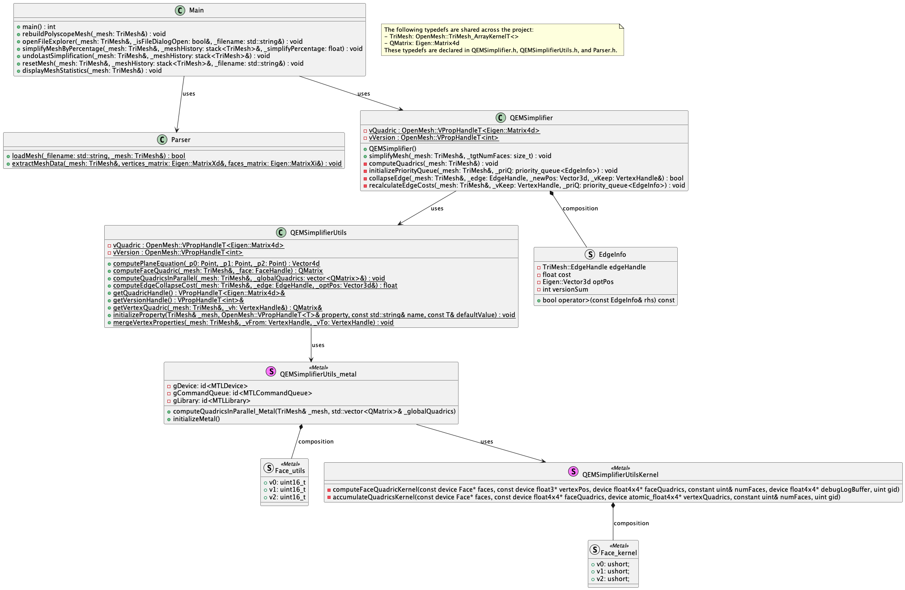
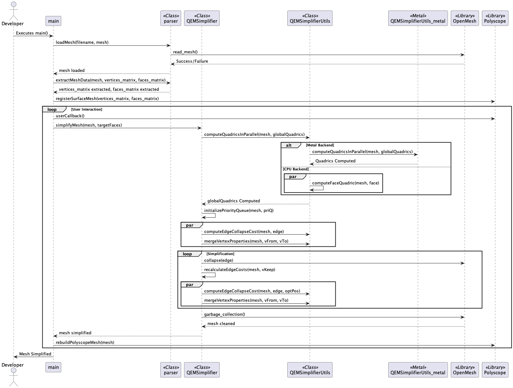
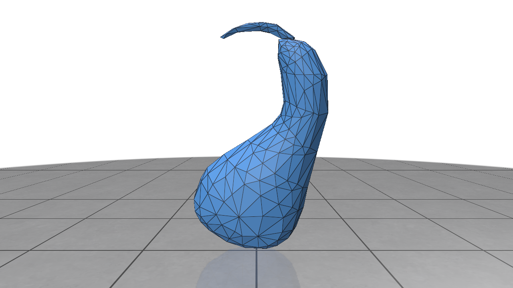

[](https://classroom.github.com/a/RM1pL2Qm)

# Surface Simplification Using Quadric Error Metrics

\[Paper found [here](./References/Surface%20Simplification%20Using%20Quadric%20Error%20Metrics.pdf)\]

This project implements a mesh simplification algorithm based on Quadric Error Metrics (QEM). It allows high-quality approximations of polygonal models through iterative vertex pair contractions. The program is designed for efficiency, with an emphasis on maintaining surface error approximations using quadric matrices.

> ## Table of Contents:
> - [Overview](#overview)
> - [UML Diagrams](#uml-diagrams)
> - [Build Instructions](#build-instructions)
> - [Testing instructions](#testing-instructions)
> - [UI](#ui)
> - [Demo](#demo)

## Overview
* Simplifies polygonal models using Quadric Error Metrics (QEM).
* Iterative contractions of vertex pairs to reduce model complexity.
* Efficient handling of surface error approximations with quadric matrices.

* Algorithm highlights:
    1. Precompute quadrics for all vertices.
    2. Calculate the optimal contraction target for each valid vertex pair.
    3. Use a priority queue to iteratively simplify the mesh based on minimal error cost.

* Algorithm:
    1. Compute the **Q** matrices for all initial vertices
        - **Q** matrices are a 4x4 error matrix that is computed using a  heuristic given by Ronfard and Rossignac
    2. Select all valid pairs
    3. Compute the optimal contraction target <strong><span style="text-decoration:overline;">v</span></strong> for each valid pair <strong>(v<sub>1</sub>, v<sub>2</sub>)</strong>. The error <strong>
  <span style="text-decoration:overline;">v</span><sup>T</sup> (Q<sub>1</sub> + Q<sub>2</sub>) <span style="text-decoration:overline;">v</span></strong> of this target vertex becomes the _cost_ of contracting that pair.
    1. Place all the pairs in a heap keyed on cost with the minimum cost pair at the top
    2. Iteratively remove the pair <strong>(v<sub>1</sub>, v<sub>2</sub>)</strong> of least cost from the heap, constract this pair, and update the costs of all valid pairs involving <strong>v<sub>1</sub></strong>
</strong>

## UML-diagrams

### Class Diagram
Markup source [here](./uml/class-diagram.puml)



### Sequence Diagram:
Markup source [here](./uml/seq-diagram.puml)



## Build Instructions

1. **Clone the Repository**
    ```bash
    git clone git@github.com:NCCA/programming-project-AnuKritiW.git
    cd programming-project-AnuKritiW
    ```

2. **Dependencies** The project manages dependencies automatically via **CMake**.

    Ensure **CMake** is installed on your system, and the build process will fetch and configure the following libraries:

    * **Eigen**: For linear algebra computations.
    * **OpenMesh**: For mesh processing.
    * **Polyscope**: For the graphical user interface (GUI).
    * **tinyfiledialogs**: For file dialog and explorer capabilities.
    * **GoogleTest (GTest)**: For unit testing.
    * **OpenMP** (optional): Enables parallel computation to improve performance on multi-core systems.
        * **macOS**: Ensure the OpenMP runtime (libomp) is installed. You can install it via Homebrew:
            ```bash
            brew install libomp
            ```

            Alternatively,

            ```bash
            git clone --depth=1 https://github.com/llvm/llvm-project.git
            cd llvm-project
            mkdir build && cd build
            cmake -G "Unix Makefiles" ../openmp \
                -DCMAKE_BUILD_TYPE=Release \
                -DCMAKE_INSTALL_PREFIX=/usr/local \
                -DCMAKE_OSX_ARCHITECTURES=arm64
            make -j$(sysctl -n hw.logicalcpu)
            sudo make install
            ```

            To verify,
            ```bash
            ➜  ~ file /usr/local/lib/libomp.dylib
            /usr/local/lib/libomp.dylib: Mach-O 64-bit dynamically linked shared library arm64  # expected output
        * **Linux**: Most GCC and Clang distributions include OpenMP support by default.
        * **Windows**: OpenMP is included in most recent versions of MSVC.
    * **Metal** (macOS only): Used for GPU-accelerated computations when the `{USE_METAL}` option is enabled. This feature requires macOS and the Metal framework.

3. **Build the Project** Run the following commands to configure and build the project:
    ```bash
    mkdir build && cd build
    cmake ..
    make
    ./QEMSimplifier
    ```

4. **OpenMP build (Optional)**

    If building with OpenMP dependency, use the following CMake command instead:
    ```bash
    cmake -DUSE_OPENMP=ON ..
    make
    ./QEMSimplifier
    ```

5. **Metal build (Optional)**

    If building with Metal support, use the following CMake command instead:
    ```bash
    cmake -DUSE_METAL=ON ..
    make
    ./QEMSimplifier
    ```

## Testing instructions

The project includes multiple test executables to validate its functionality:

1. **Run All Tests** From the build directory, you can run all the tests using:
    ```bash
    ./MainTests
    ```
2. **Run Specific Tests** The tests are divided into the following executables:
    * `MainTests`
    * `ParserTests`
    * `QEMSimplifierTests`
    * `QEMSimplifierUtilsTests`

    To run specific test executables directly:
    ```bash
    ./tests/MainTests
    ./tests/ParserTests
    ./tests/QEMSimplifierTests
    ./tests/QEMSimplifierUtilsTests
    ```
3. **Run Smaller Tests in Parallel** To execute specific tests in parallel, you can use the following `ctest` command:
    ```bash
    ctest --output-on-failure -j11 --tests-regex "ParserTests|QEMSimplifierUtilsTests|QEMSimplifierTests"
    ```
    This approach runs only the specified test executables in parallel, speeding up the testing process.

## UI


## Demo

### Demo with narration found [here](https://youtu.be/AmDRhxQTcSE)

### Demo preview below


Here are some results of mesh simplification using this program:


| Simplification Level | Vertices | Edges | Faces | Screenshot                                           |
| -------------------- | -------- | ----- | ----- | ---------------------------------------------------- |
| Original             | 326      | 972   | 648   |  |
| 10%                  | 293      | 873   | 582   |  |
| 25%                  | 245      | 729   | 486   |  |
| 50%                  | 164      | 486   | 324   |  |
| 75%                  | 83       | 243   | 162   |  |
| 90%                  | 34       | 96    | 64    |  |
