[](https://classroom.github.com/a/RM1pL2Qm)

# Project ideas

## Contents
1. [Inverse Toon Shading](#inverse-toon-shading)
2. [Navigating Intrinsic Triangulations](#navigating-intrinsic-triangulations)
3. [NPR-related stuff- shaders, outline detection](#npr-related-stuff--shaders-outline-detection)
4. [Light Exposure Visualisation Tool (?) for Maya](#light-exposure-visualisation-tool--for-maya)
5. [Seamless Parametrization in Penner Coordinates](#seamless-parametrization-in-penner-coordinates)
6. [Adjoint Nonlinear Ray Tracing](#adjoint-nonlinear-ray-tracing)
7. [Stylizing Ribbons: Computing Surface Contours with Temporally Coherent Orientations](#stylizing-ribbons-computing-surface-contours-with-temporally-coherent-orientations)
8. [Surface Simplification Using Quadric Error Metrics](#surface-simplification-using-quadric-error-metrics)
9. [Garment Refitting for Digital Characters](#garment-refitting-for-digital-characters)
10. [Hair Simulation](#hair-simulation)

## Inverse Toon Shading

\[Paper found [here](./References/InverseToonShading/Inverse%20Toon%20Shading-%20Interactive%20Normal%20Field%20Modeling%20with%20Isophotes.pdf)]

* Inverse Toon shading is the transformation of a discrete or toon-shaded image into a smooth 3D normal field that matches the discrete shading.
* Create plausible normal fields with user input of a 2D silhouette of a smooth object + toon-shadings of the interior
* Each toon shading is interpreted as a set of _isophate curves_ sharing the same light direction.
    * artists pick light directions and draw isophate shapes, where the 2D isophate is indicative of its 3D shape
    * 3D surface normals change smoothly along the isophates with minimal variation.

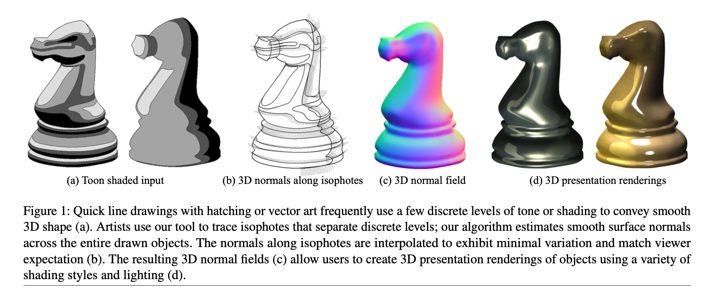

- An _isophote_ is the line that demarcates the boundaries between discrete toon shaded regions
- The intersection of the _isophote_ and the silhouette (the outline of the overall toon in 3D) indicates the light direction
    - The normal vectors at these intersections along with the isophote's luminance value specify the light direction in 3D
        - all 3D surface normals along the isophote  must lie on a cone of vectors around the light direction

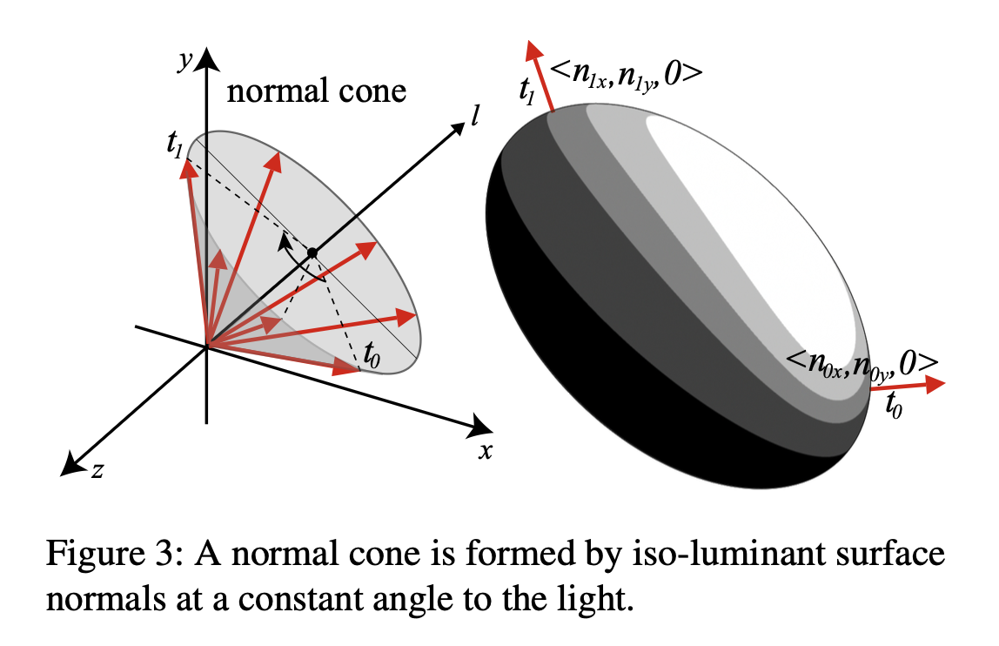

- Can interpolate between the two known 3D normals at the silhouette to get the surface
    - a series of operations here.
    1. linearly interpolate around the light cone as a function of 2D arc length.
    2. the 3D normals along the isophote are used to compute the 3D tangent vectors
    3. 3D tangent vectors used to iteratively re interpolate 3D normals as a function of 3D isophote arc length
    4. 3D normals along silhouettes and isophotes are diffused into the interior of the shape

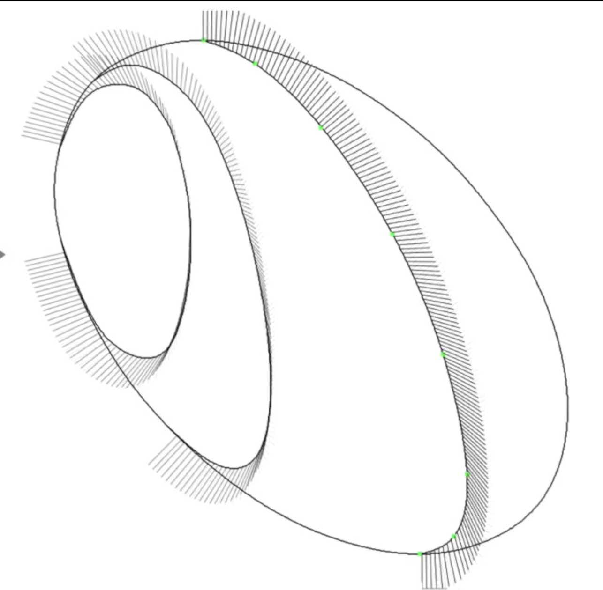
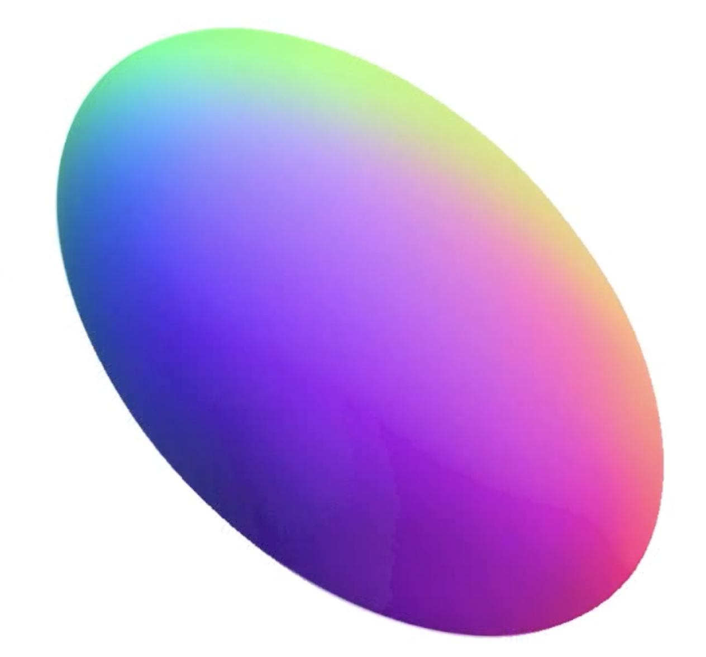

The above is for simple toons. For complex toons e.g.

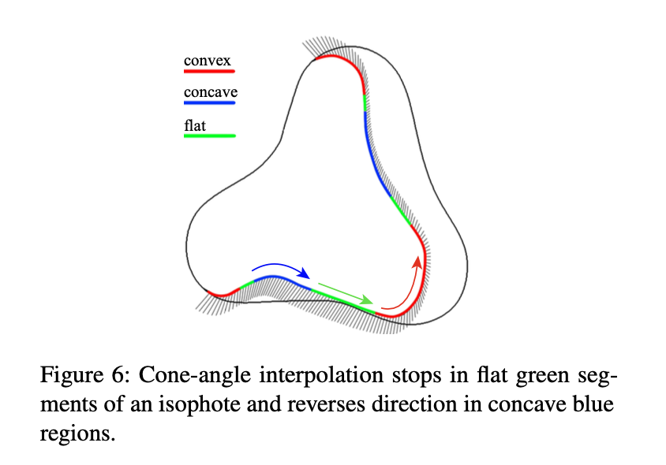

- expect the projected 2D curve to be indicative of the 3D shape
- because inflection points are preserved when projecting from 3D to 2D, can break the 2D isophotes into convex, concave and flat sections as in the image above
    - concave sections: reverse interpolation direction around the light cone
    - flat sections: keep the 3D normal constant

The authors of this paper created a tool for artists to specify the isophotes. Their demo can be seen [here](https://youtu.be/ltlILoMVQ6A?si=IPn3YaL5knYken8o&t=149)

[Back to contents](#contents)

## Navigating Intrinsic Triangulations

\[Paper found [here](./References/NavigatingIntrinsicTriangulations/Navigating%20Intrinsic%20Triangulations.pdf); project page found [here](http://www.cs.cmu.edu/~kmcrane/Projects/NavigatingIntrinsicTriangulations/index.html)\]

* Present a **signpost data structure** that makes it easy to run computational geometry algorithms on **poor-quality surface meshes** (e.g. meshes with skinny triangles)
* Operates as a black-box -- eliminating need to change the geometry for processing
* Method considers **intrinsic triangulation** which connect vertices by straight paths along the exact geometry of the input mesh
* **Signpost data structure** stores the direction and distance to each neighbouring vertex.

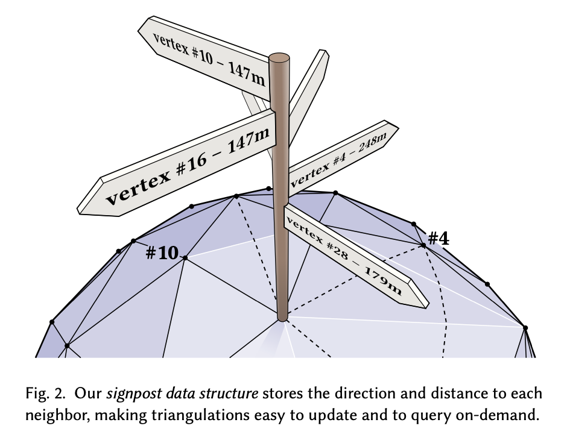
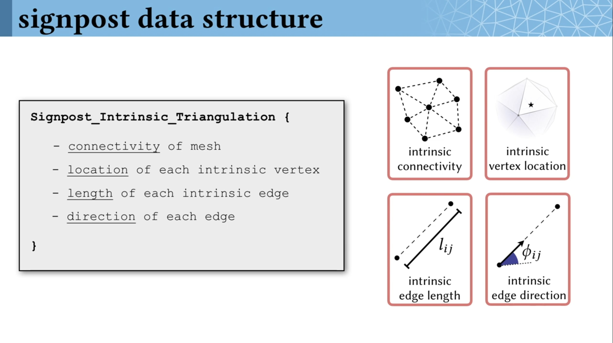

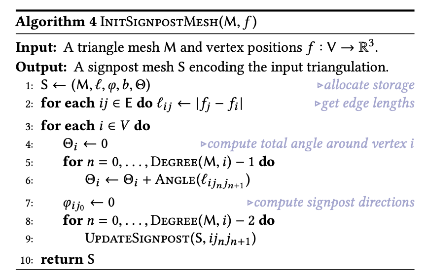

* the **Signpost data structure** supports the following queries:
    1. Tracing query
        - follows a signpost to its destination
        - e.g. used when intializing the data structure, edge flips, vertex insertions, etc.\
        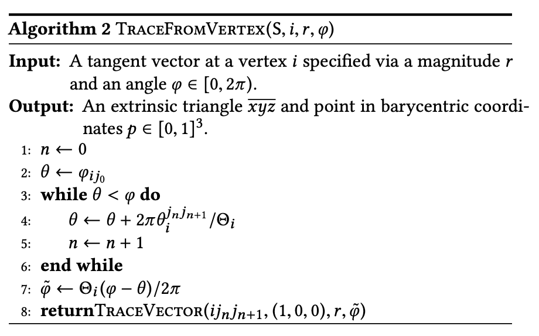
    2. Signpost update
        - updates the direction of a single signpost
        - essentially unfolding triangles along the path and drawing a straight line; can be carried out in a local 2D coordinate system
        ```
        1. each vertex of a path is found by computing 2D ray-line intersections and moving to the closest intersection point.
        2. direction of the ray is transformed into the coord system of the next triangle (by constructing a vector that makes the same angle with the shared edge)
        3. repeat (1) and (2)
        4. final output is the barycentric coordinates of the point q as well as a pointer to the triangle containing q
        ```
        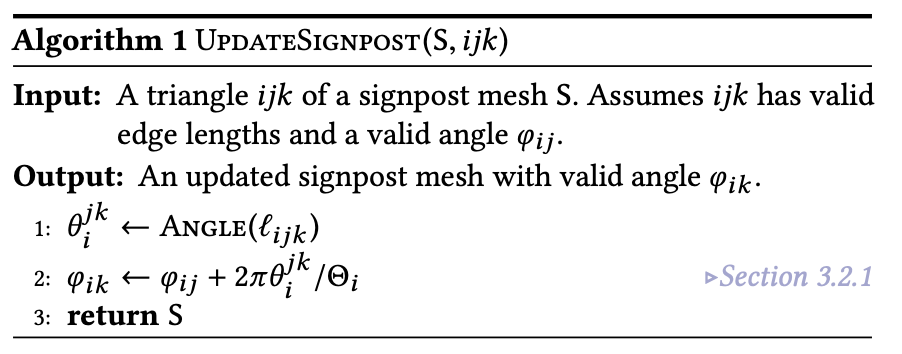
    3. Vertex update
        - combines (1) and (2) to update the signposts around a vertex
        - Many local operations would compute new lengths for edges incident on a single vertex
        - would need to use these new lengths to update other quantities\
        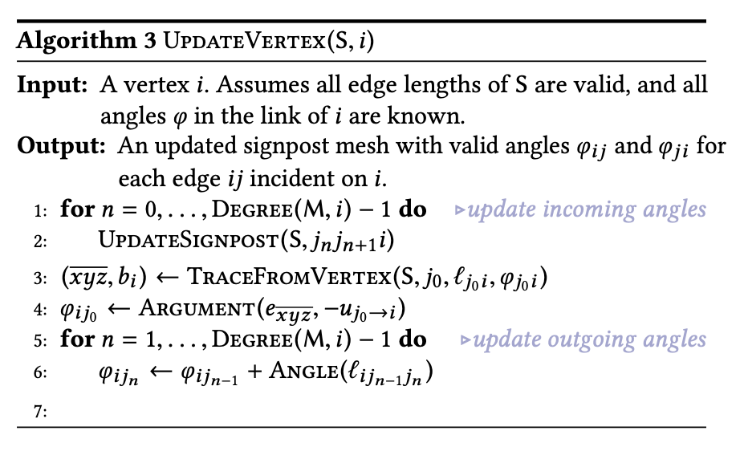
    * These allow all other operations to be implemented

* The paper also explores how many existing operations can then be applied such as:
    * Edge flip
    * Vertex Insertion
    * Vertex Repositioning
* Psuedocodes are provided for these operations as well.

* The **Signpost data structure** is particularly attractive owing to it's 1:1 **correspondence** between points on an intrinsic triangulation and the underlying extrinsic triangulation.
    - can query the relationship directly without building an auxiliary structure
    - makes the **signpost data structure** compatible with sample-based rendering like ray-tracing

* The paper further goes to show how difference classes of retriangulation algorithms can be implemented using the signpost data structure. Namely:
    - Delaunay Flipping
    - Intrinsic Delaunay Refinement (iDR)
    - Intrinsic Optimal Delaunay Triangulation (iODT)

* The paper also discusses how the **signpost data structure** enables a broad range of techniques from computational geometry and scientific computing to be applied in the polyhedral setting. Examples considered include:
    - Steiner Tree Approximation
    - Finite Elements
    - Geodesic Distance
    - Adaptive Mesh Refinement
    - Tangent Vector Field Processing

[Back to contents](#contents)

## NPR-related stuff- shaders, outline detection

Implementing a cross hatch/halftone dot shader would be cool. I'm still looking into this but I've collated some resources so far below.

\[Paper on [Interactive Pen-and-Ink Illustration](./References/Interactive%20Pen-and-Ink%20Illustration.pdf)\]
- some reference for textures and methods like hatching, cross-hatching, stippling

\[Paper on [Real-Time Hatching](./References/Real-Time%20Hatching.pdf)]
- Uses concept of tonal art maps (TAM)
- General and can be used to represent a variety of aesthetics (e.g. pencil, crayon, stippling, and charcoal).
- I think this assumes you have an input of a scene already, and works off of the intensity in the input image to assign a hatch sample to
    - need to read in more detail

Cool reference using WebGL (.js) [here](https://spite.github.io/sketch/)

\[Paper on [Suggestive Contours for Conveying Shape](./References/Suggestive%20Contours%20for%20Conveying%20Shape.pdf)]

Book [Non-Photorealistic Rendering](https://www.google.co.uk/books/edition/Non_Photorealistic_Rendering/AWG1DwAAQBAJ?hl=en&gbpv=1&printsec=frontcover) by Bruce Gooch and Amy Gooch

[Back to contents](#contents)

## Light Exposure Visualisation Tool (?) for Maya

Toying with the idea of trying to help animators visually assess the need for more focus on regions that are more well-lit and vice-versa. Might be too ambitious for the ASE project but perhaps some small part of this?

Idea is roughly while animating, seeing the light gradient can help animators place characters effectively within the light to ensure they’re visible and properly oriented for the camera. This tool would give them immediate visual feedback on the light exposure of specific areas, allowing them to avoid issues like having characters unintentionally in shadow.

So instead of a full light rendering, there is a frame-by-frame light exposure visualization tool that can be cached based on camera movement. The tool can be toggled on and off as needed. Green regions are the most lit while red is in darkness. There is a gradient of shades in between. Not sure if something like that has been done before, if it would be useful in a typical offline-rendering pipelines, if lights are even in place before it reaches the animators and so on. Need to investigate this further if it's worth doing.

[Back to contents](#contents)

## Seamless Parametrization in Penner Coordinates

\[Paper found [here](./References/Seamless%20Parametrization%20in%20Penner%20Coordinates.pdf)\]

* cites **Navigating Intrinsic Triangulations** (above)

### (to update)

[Back to contents](#contents)

## Adjoint Nonlinear Ray Tracing
\[Paper found [here](./References/Adjoint%20Nonlinear%20Ray%20Tracing.pdf)\]

* Considers continuously-varying refractive index fields
* method for optimizing refractive index fields that accounts for both curved light paths and has a small, constant memory footprint
* use adjoint state method to derive a set of equations for computing derivatives wrt the refractive index field of optimizing objectives that are subject to nonlinear ray tracing constraints
* intro discretization schemes to numerically evaluate the eqns
### (to update)

[Back to contents](#contents)

## Stylizing Ribbons: Computing Surface Contours with Temporally Coherent Orientations

\[Paper found [here](./References/StylizingRibbons/Stylizing%20Ribbons-%20Computing%20Surface%20Contours%20with%20Temporally%20Coherent%20Orientations.pdf)\]

* To do with line work in stylized animation (e.g. Spider-verse, Soul, etc.)
* Offers artists direct control over the inside and outside of surface contours.
* Method creates _ribbons_, geometry strips that extrude from each side of the surface contour with temporally coherent orientations.
    * Generation of spatially and temporally consistent normal orientations along visible contours\
    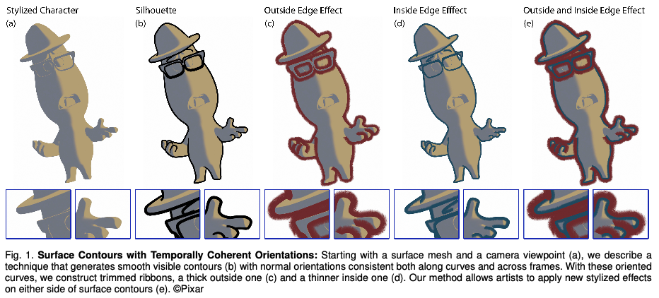
    * trimming routine that converts arrangements of offset curves into ribbons free of intersections\
    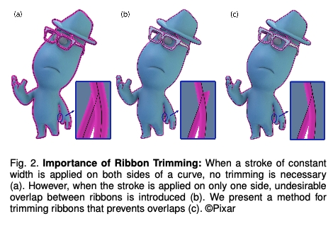

* Pseudo-code\
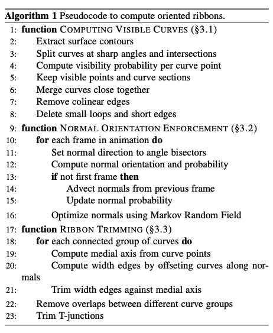

[Back to contents](#contents)

## Surface Simplification Using Quadric Error Metrics

\[Paper found [here](./References/Surface%20Simplification%20Using%20Quadric%20Error%20Metrics.pdf)\]

* Produce high quality approximations of polygonal models
* Iterative contractions of vertex pairs to simplify models
* Maintains surface error approximations using quadric matrices

* Algorithm:
    1. Compute the **Q** matrices for all initial vertices
        - **Q** matrices are a 4x4 error matrix that is computed using a  heuristic given by Ronfard and Rossignac
    2. Select all valid pairs
    3. Compute the optimal contraction target <strong><span style="text-decoration:overline;">v</span></strong> for each valid pair <strong>(v<sub>1</sub>, v<sub>2</sub>)</strong>. The error <strong>
  <span style="text-decoration:overline;">v</span><sup>T</sup> (Q<sub>1</sub> + Q<sub>2</sub>) <span style="text-decoration:overline;">v</span></strong> of this target vertex becomes the _cost_ of contracting that pair.
    4. Place all the pairs in a heap keyed on cost with the minimum cost pair at the top
    5. Iteratively remove the pair <strong>(v<sub>1</sub>, v<sub>2</sub>)</strong> of least cost from the heap, constract this pair, and update the costs of all valid pairs involving <strong>v<sub>1</sub></strong>
</strong>

* Psuedo-ish code to my understanding

```python
def GetValidPairs(_v1, _start_idx, _model):
    threshold = t # some arbitrary value
    valid_pairs = []

    # ensure no repeated pairings
    for idx in range(start_idx, len(_model.vertices)):
        v2 = _model.vertices[idx]
        if (_v1 != v2):
            if ((IsEdge(_v1, v2)) || (Dist(_v1, v2) < threshold)):
                valid_pairs.insert(v2))

    return valid_pairs


def SimplifyModel(_model):
    valid_pairs = {} # of the form {v1: {v2, v4, v5}, v2: {v3}, etc.}; no repeated pairs
    v_to_Q_dict = {}

    for idx in range(len(_model.vertices)):
        v = _model.vertices[idx]

        """
        Compute error matrix Q at v # 4x4 matrix
        """

        v_to_Q_dict[v] = Q
        valid_pairs[v] = set(GetValidPairs(v, idx, _model))

    min_heap = []
    for (key, value) in valid_pairs:
        minDist = np.array([[0],
                            [0],
                            [0],
                            [1]])
        avg_Q = v_to_Q_dict[key] + v_to_Q_dict[value]
        new_v = np.dot(np.linalg.inv(avg_Q), minDist) # perform matrix multiplication

        # Compute cost for contracting the vertex_pair
        cost = np.dot(np.dot(np.transpose(new_v), avg_Q), new_v)

        # min_heap is organized by cost, with the smallest cost at the root
        heapq.heappush(min_heap, (cost, (key, value), new_v))

    while min_heap:
        cost, vertex_pair, new_v = heapq.heappop(min_heap)

        # contract vertex_pair
        v1 = vertex_pair.first
        v2 = vertex_pair.second

        # since the value in valid_pairs is a set, repetitions are handled automatically
        valid_pairs[v1].insert(valid_pairs[v2])

        # since repeated pairs were handled in GetValidPairs always iterating thorugh a partial range as needed, v2 no longer exists in valid_pairs

        """
        TODO:
        Update v1 to new_v in valid_pairs
        Update costs for pairs involving v1
        """

```

[Back to contents](#contents)

## Garment Refitting for Digital Characters

\[Paper found [here](./References/Garment%20Refitting%20for%20Digital%20Characters.pdf)\]

* New technique to refit garments between characters of different shapes
* Iterative scheme alternating between relaxation and rebinding optimizations
    * **relaxation**: uses **affine-invariant coordinates** to adapt the input 3D garment to the shape of the target while **minimizing mesh distortion**
    * **rebinding**: reset spacing between the refitted garment and the character body controlled by **tightness values**
* Method also supports additional constraints that encode the spatial and structural arrangement of **multi-layers, seams and fold-overs**

[Back to contents](#contents)

## Hair Simulation

\[SIGGRAPH Course Notes [here](https://developer.download.nvidia.com/presentations/2010/SIGGRAPH/HairCourse_SIGGRAPH2010.pdf)\]

### to update?

[Back to contents](#contents)