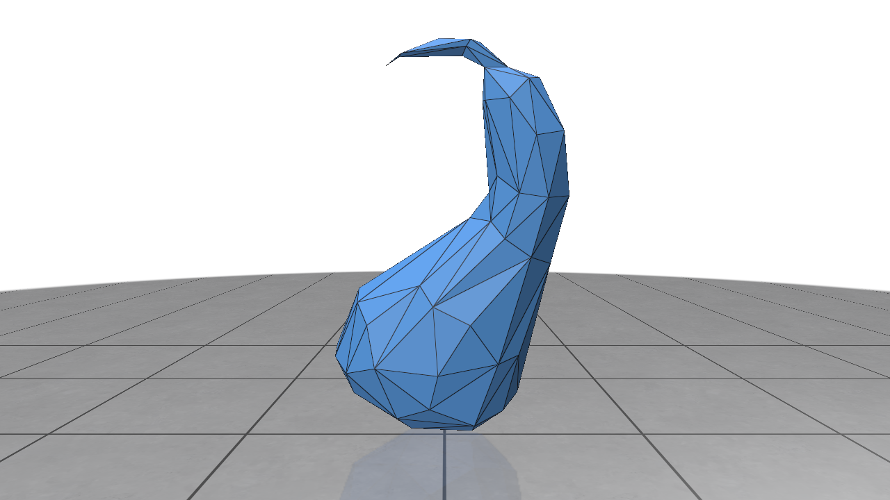

[](https://classroom.github.com/a/RM1pL2Qm)

# Surface Simplification Using Quadric Error Metrics

\[Paper found [here](./References/Surface%20Simplification%20Using%20Quadric%20Error%20Metrics.pdf)\]

This project implements a mesh simplification algorithm based on Quadric Error Metrics (QEM). It allows high-quality approximations of polygonal models through iterative vertex pair contractions. The program is designed for efficiency, with an emphasis on maintaining surface error approximations using quadric matrices.

> ## Table of Contents:
> - [Overview](#overview)
> - [Build Instructions](#build-instructions)
> - [Testing instructions](#testing-instructions)
> - [UI](#ui)
> - [Demo](#demo)
> - [TODOs](#todos)

## Overview
* Simplifies polygonal models using Quadric Error Metrics (QEM).
* Iterative contractions of vertex pairs to reduce model complexity.
* Efficient handling of surface error approximations with quadric matrices.

* Algorithm highlights:
    1. Precompute quadrics for all vertices.
    2. Calculate the optimal contraction target for each valid vertex pair.
    3. Use a priority queue to iteratively simplify the mesh based on minimal error cost.

* Algorithm:
    1. Compute the **Q** matrices for all initial vertices
        - **Q** matrices are a 4x4 error matrix that is computed using a  heuristic given by Ronfard and Rossignac
    2. Select all valid pairs
    3. Compute the optimal contraction target <strong><span style="text-decoration:overline;">v</span></strong> for each valid pair <strong>(v<sub>1</sub>, v<sub>2</sub>)</strong>. The error <strong>
  <span style="text-decoration:overline;">v</span><sup>T</sup> (Q<sub>1</sub> + Q<sub>2</sub>) <span style="text-decoration:overline;">v</span></strong> of this target vertex becomes the _cost_ of contracting that pair.
    1. Place all the pairs in a heap keyed on cost with the minimum cost pair at the top
    2. Iteratively remove the pair <strong>(v<sub>1</sub>, v<sub>2</sub>)</strong> of least cost from the heap, constract this pair, and update the costs of all valid pairs involving <strong>v<sub>1</sub></strong>
</strong>

## Build Instructions

1. **Clone the Repository**
    ```
    git clone git@github.com:NCCA/programming-project-AnuKritiW.git
    cd programming-project-AnuKritiW
    ```

2. **Install Dependencies** The project currently requires the following dependencies to be installed manually:
    * Eigen: For linear algebra computations.
    * OpenMesh: For mesh processing.
    * CMake: For build system configuration.

    Ensure these libraries are installed on your system before building the project.

3. **Build the Project** Run the following commands to configure and build the project:
    ```
    mkdir build && cd build
    cmake ..
    make
    ./QEMSimplifier
    ```

4. **Metal build (Optional)**

    If building with Metal support, use the following CMake command instead:
    ```
    cmake -DUSE_METAL=ON ..
    make
    ./QEMSimplifier
    ```

## Testing instructions

The project includes multiple test executables to validate its functionality:

1. **Run All Tests** From the build directory, you can run all the tests using:
    ```
    ./MainTests
    ```
2. **Run Specific Tests** The tests are divided into the following executables:
    * `MainTests`
    * `ParserTests`
    * `QEMSimplifierTests`
    * `QEMSimplifierUtilsTests`

    To run specific test executables directly:
    ```
    ./tests/MainTests
    ./tests/ParserTests
    ./tests/QEMSimplifierTests
    ./tests/QEMSimplifierUtilsTests
    ```
3. **Run Smaller Tests in Parallel** To execute specific tests in parallel, you can use the following `ctest` command:
    ```
    ctest --output-on-failure -j11 --tests-regex "ParserTests|QEMSimplifierUtilsTests|QEMSimplifierTests"
    ```
    This approach runs only the specified test executables in parallel, speeding up the testing process.

## UI


## Demo

*** link to demo video ***

Here are some results of mesh simplification using this program:


| Simplification Level | Screenshot                                           |
| -------------------- | ---------------------------------------------------- |
| Original             |  |
| 25%                  |  |
| 50%                  |  |
| 75%                  |  |
| 90%                  |  |

## TODOs

* Have CMakeLists fetch dependencies
* Add button in polyscope viewer to simplify to n faces in real time.
