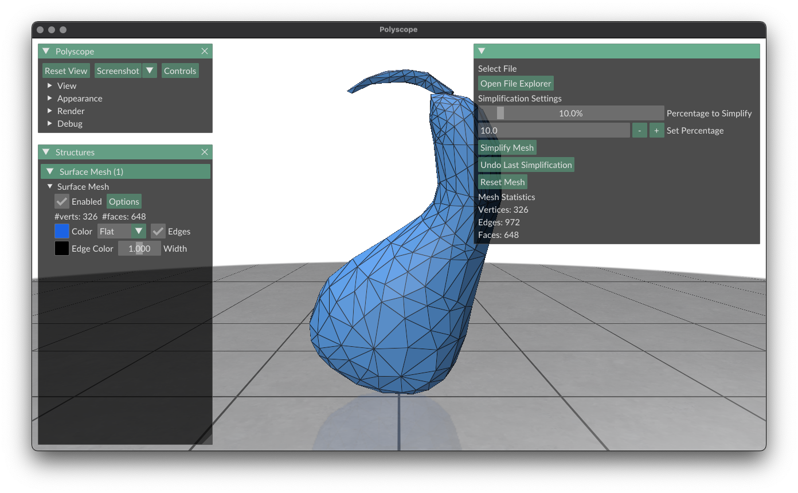

[](https://classroom.github.com/a/RM1pL2Qm)

# Surface Simplification Using Quadric Error Metrics

\[Paper found [here](./References/Surface%20Simplification%20Using%20Quadric%20Error%20Metrics.pdf)\]

This project implements a mesh simplification algorithm based on Quadric Error Metrics (QEM). It allows high-quality approximations of polygonal models through iterative vertex pair contractions. The program is designed for efficiency, with an emphasis on maintaining surface error approximations using quadric matrices.

> ## Table of Contents:
> - [Overview](#overview)
> - [UML Diagrams](#uml-diagrams)
> - [Build Instructions](#build-instructions)
> - [Testing instructions](#testing-instructions)
> - [UI](#ui)
> - [Demo](#demo)
> - [Use of Modern C++](#use-of-modern-c)
> - [Branching and PRs](#branching-and-PRs)
> - [Multithreading using OpenMP](#multithreading-using-openmp)
> - [Performing calculations on a GPU using Metal](#performing-calculations-on-a-gpu-using-metal)
> - [Continuous Integration using Github Actions](#continuous-integration-using-github-actions)
> - [References](#references)

## Overview
* Simplifies polygonal models using Quadric Error Metrics (QEM).
* Iterative contractions of vertex pairs to reduce model complexity.
* Efficient handling of surface error approximations with quadric matrices.

* Algorithm highlights:
    1. Precompute quadrics for all vertices.
    2. Calculate the optimal contraction target for each valid vertex pair.
    3. Use a priority queue to iteratively simplify the mesh based on minimal error cost.

* Algorithm:
    1. Compute the **Q** matrices for all initial vertices
        - **Q** matrices are a 4x4 error matrix that is computed using a  heuristic given by Ronfard and Rossignac
    2. Select all valid pairs
    3. Compute the optimal contraction target <strong><span style="text-decoration:overline;">v</span></strong> for each valid pair <strong>(v<sub>1</sub>, v<sub>2</sub>)</strong>. The error <strong>
  <span style="text-decoration:overline;">v</span><sup>T</sup> (Q<sub>1</sub> + Q<sub>2</sub>) <span style="text-decoration:overline;">v</span></strong> of this target vertex becomes the _cost_ of contracting that pair.
    1. Place all the pairs in a heap keyed on cost with the minimum cost pair at the top
    2. Iteratively remove the pair <strong>(v<sub>1</sub>, v<sub>2</sub>)</strong> of least cost from the heap, constract this pair, and update the costs of all valid pairs involving <strong>v<sub>1</sub></strong>
</strong>

## UML-diagrams

### Class Diagram
Markup source [here](./uml/class-diagram.puml)


### Sequence Diagram:
Markup source [here](./uml/seq-diagram.puml)


## Build Instructions

1. **Clone the Repository**
    ```bash
    git clone git@github.com:NCCA/programming-project-AnuKritiW.git
    cd programming-project-AnuKritiW
    ```

2. **Dependencies** The project manages dependencies automatically via **CMake**.

    Ensure **CMake** is installed on your system, and the build process will fetch and configure the following libraries:

    * **Eigen**: For linear algebra computations.
    * **OpenMesh**: For mesh processing.
    * **Polyscope**: For the graphical user interface (GUI).
    * **tinyfiledialogs**: For file dialog and explorer capabilities.
    * **GoogleTest (GTest)**: For unit testing.
    * **OpenMP** (optional): Enables parallel computation to improve performance on multi-core systems.
        * **macOS**: Ensure the OpenMP runtime (libomp) is installed. You can install it via Homebrew:
            ```bash
            brew install libomp
            ```

            Alternatively,

            ```bash
            git clone --depth=1 https://github.com/llvm/llvm-project.git
            cd llvm-project
            mkdir build && cd build
            cmake -G "Unix Makefiles" ../openmp \
                -DCMAKE_BUILD_TYPE=Release \
                -DCMAKE_INSTALL_PREFIX=/usr/local \
                -DCMAKE_OSX_ARCHITECTURES=arm64
            make -j$(sysctl -n hw.logicalcpu)
            sudo make install
            ```

            To verify,
            ```bash
            ➜  ~ file /usr/local/lib/libomp.dylib
            /usr/local/lib/libomp.dylib: Mach-O 64-bit dynamically linked shared library arm64  # expected output
        * **Linux**: Most GCC and Clang distributions include OpenMP support by default.
        * **Windows**: OpenMP is included in most recent versions of MSVC.
    * **Metal** (macOS only): Used for GPU-accelerated computations when the `{USE_METAL}` option is enabled. This feature requires macOS and the Metal framework.

3. **Build the Project** Run the following commands to configure and build the project:
    ```bash
    mkdir build && cd build
    cmake ..
    make
    ./QEMSimplifier
    ```

4. **OpenMP build (Optional)**

    If building with OpenMP dependency, use the following CMake command instead:
    ```bash
    cmake -DUSE_OPENMP=ON ..
    make
    ./QEMSimplifier
    ```

5. **Metal build (Optional)**

    If building with Metal support, use the following CMake command instead:
    ```bash
    cmake -DUSE_METAL=ON ..
    make
    ./QEMSimplifier
    ```

## Testing instructions

The project includes multiple test executables to validate its functionality:

1. **Run All Tests** From the build directory, you can run all the tests using:
    ```bash
    ./MainTests
    ```
2. **Run Specific Tests** The tests are divided into the following executables:
    * `MainTests`
    * `ParserTests`
    * `QEMSimplifierTests`
    * `QEMSimplifierUtilsTests`

    To run specific test executables directly:
    ```bash
    ./tests/MainTests
    ./tests/ParserTests
    ./tests/QEMSimplifierTests
    ./tests/QEMSimplifierUtilsTests
    ```
3. **Run Smaller Tests in Parallel** To execute specific tests in parallel, you can use the following `ctest` command:
    ```bash
    ctest --output-on-failure -j11 --tests-regex "ParserTests|QEMSimplifierUtilsTests|QEMSimplifierTests"
    ```
    This approach runs only the specified test executables in parallel, speeding up the testing process.

## UI



## Demo

### Demo with narration found [here](https://youtu.be/AmDRhxQTcSE)

### Demo preview below


Here are some results of mesh simplification using this program:


| Simplification Level | Vertices | Edges | Faces | Screenshot                                           |
| -------------------- | -------- | ----- | ----- | ---------------------------------------------------- |
| Original             | 326      | 972   | 648   |  |
| 10%                  | 293      | 873   | 582   |  |
| 25%                  | 245      | 729   | 486   |  |
| 50%                  | 164      | 486   | 324   |  |
| 75%                  | 83       | 243   | 162   |  |
| 90%                  | 34       | 96    | 64    |  |

# Use of Modern C++

* **Templates**: Used in `QEMSimplifierUtils.h` for initializing and merging mesh properties, ensuring reusability and type safety across various property types​​.

    ```cpp
    template <typename T>
    static void initializeProperty(TriMesh& _mesh, OpenMesh::VPropHandleT<T>& property, const std::string& name, const T& defaultValue) { ... };
    ```

* **Lambdas**: Simplifed code logic within UI callbacks for the Polyscope viewer integration in `main.cpp`​.
    ```cpp
    polyscope::state::userCallback = [&mesh, &filename]() { ... }
    ```

* **Standard Template Library (STL)**: STL containers like `std::vector` and `std::priority_queue` manage mesh data and edge collapse costs efficiently.

* **RAII (Resource Acquisition Is Initialization):**:
    * In `computeQuadricsInParallel_Metal` (in `QEMSimplifierUtils_metal.mm`), instead of using raw arrays for managing face and vertex data, `std::vector` was used to safely allocate and manage memory as it automatically handles memory allocation/deallocation.
        ```cpp
        std::vector<Face> facesVec(numFaces);
        std::vector<simd::float3> vertPos(numVerts);
        std::vector<bool> visitedVerts(numVerts, false);
        ```
    * Use of `id<MTLBuffer>` (in `QEMSimplifierUtils_metal.mm`) objects to handle GPU memory, avoiding manual memory management. `newBufferWithBytes` method encapsulates the memory allocation and ensures proper cleanup, allowing the Metal framework to manage the lifecycle of GPU buffers.
        ```cpp
        id<MTLBuffer> facesBuf = [gDevice newBufferWithBytes:facesVec.data()
                                  length:facesVec.size() * sizeof(Face)
                                  options:MTLResourceStorageModeShared];
        ```
    * Eigen Matrices: Eigen’s matrix objects are used extensively across the project for safe, scope-bound memory handling during mathematical computations​​.

## Branching and PRs

Feature branches and bug-fix branches were used consistently to ensure the `main` branch remained stable and production-ready.
* **Feature Branches**: Each feature/functionality, such as multithreading (OpenMP) or GPU acceleration (Metal), was developed on a separate branch to isolate changes.
* **Pull Requests (PRs)**: All changes were merged into the main branch through well-documented PRs. Each PR included a detailed description of the changes, making it easy to trace the purpose of merge commits.
* **Commit History**: The commit history consists of small, meaningful commits that clearly document the development process. Since this is an assignment submission, features and bug fixes were not squashed before merging to preserve a transparent record of interactions with the repository.

## Multithreading Using OpenMP

OpenMP was integrated to parallelize compute-intensive operations:

* **Quadrics Calculation**: Each face’s quadric matrix is computed in parallel.
* **Edge Recalculation**: Edge collapse costs are recalculated in parallel

e.g.
```cpp
#pragma omp parallel for
// for every edge, compute the cost and the new pos
for (size_t idx = 0; idx < _mesh.n_edges(); ++idx) { ... }
```

Further improvements can be done by adding validation checks.

## Performing Calculations on a GPU Using Metal

GPU acceleration using Metal was implemented for face and vertex quadric calculations:

* **Pipeline Setup**: Metal compute pipelines were initialized for face quadrics and accumulation into vertex quadrics​.
* **Data Transfer**: Mesh data, such as vertex positions and face indices, are transferred to GPU buffers for processing.
* **Compute Kernels**: Metal shaders (`computeFaceQuadricKernel` and `accumulateQuadricsKernel`) handle parallel computation on the GPU.

## Continuous Integration Using GitHub Actions

The project employs GitHub Actions for continuous integration:

* **Automated Testing**: A suite of unit tests (`ParserTests`, `QEMSimplifierTests`, etc.) is automatically executed on each push or pull request​.
* **Build Verification**: CI workflows validate builds across multiple configurations (e.g., Metal-enabled builds).
* **Parallelized Test Runs**: ctest runs are parallelized using the -j flag to speed up testing.

NOTE: As the organisation's limit of 2000 hours was hit in January, I was unable to verify that Github Actions are still running smoothly. Also, I did not add validation for the OpenMP build as this was fixed after the cap was hit.

The last successful build before the cap was hit can be found [here](https://github.com/NCCA/programming-project-AnuKritiW/actions/runs/12911878185/workflow).

The workflow file can be found in: `.github/workflows/actions.yml`

# References

Apple Developer, no date. Performing Calculations on a GPU. Apple. Available from: https://developer.apple.com/documentation/metal/performing-calculations-on-a-gpu [Accessed 4 January 2025].

Garland, M. and Heckbert, P.S., 1997. Surface simplification using quadric error metrics. Proceedings
of the 24th annual conference on Computer graphics and interactive techniques. 209-216. Available from: https://dl.acm.org/doi/abs/10.1145/258734.258849 [Accessed 28 October 2024].

Mousa, M.H. and Hussein, M.K., 2021. High-performance simplification of triangular surfaces using
a GPU. PloS one, 16(8), p.e0255832. Available from: https://journals.plos.org/plosone/article?id=10.1371/journal.pone.0255832 [Accessed 24 December 2024].

ChatGPT was used for debugging and documentation.
* When debugging, I sent my code snippets and the error message as a prompt.
* Documentation was similar in that I would send my writeups to ask for better, more concise phrasing -- for both this README and for comments within the code.
* Sometimes used for good concise commit messages based on my changes and PR descriptions based on my commit message history.